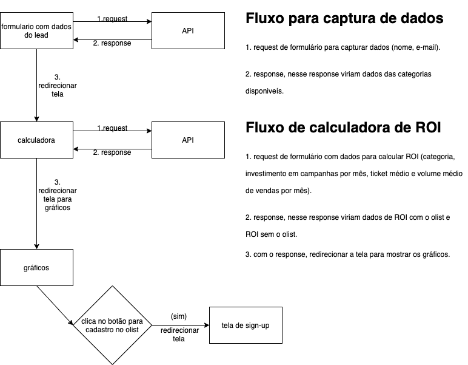

# Calculadora de ROI (frontend)
Projeto para especificar uma aplicação que calcula ROI de leads e compara o valor com os serviços do **olist**.

* O design das telas foi inspirado inicialmente nesta [página](https://olist.com/solucoes/como-comecar-a-vender/)

### Tecnologias usadas
* A calculadora ficará visível no webapp do olist (app.olist.com), e levando em conta a especificação de arquitetura, é desenvolvido em React. A instalação de dependências pode seguir a especificação no repositório do web app.

### Arquitetura
* O projeto é uma feature nova para o site, é tratado como uma tela nova antes do usuário estar logado, como por exemplo, app.olist.com/calculadora-roi.
* A parte de arquitetura segue o padrão do olist [link](https://jira-olist.atlassian.net/wiki/spaces/OP/pages/635895809/Arquitetura+de+front+do+olist).

### Telas

* Para ver prints das telas e fluxo de trabalho entre elas no figma:
[telas](https://www.figma.com/proto/yMvQvtLgKBqELgwjMttYGH/calculadora-roi-frontend?node-id=33%3A2&scaling=min-zoom)

### Campos e funcionalidades
1. **Tela inicial:**

Campo | Tipo
--- | ---
Nome do responsável | string
E-mail da empresa | string, email

2. **Tela com calculadora**

Campo | Tipo
--- | ---
Categoria dos produtos | string
Investimentos em campanha por mês | decimal
Ticket médio | decimal
Volume médio de vendas por mês | decimal

3. **Tela com resultado**
* Gráfico com ROI sem o olist
* Gráfico com ROI com o olist

### Fluxo de comunicação de telas com API
1. Fluxo de comunicação das telas com API e redirecionamento de telas

