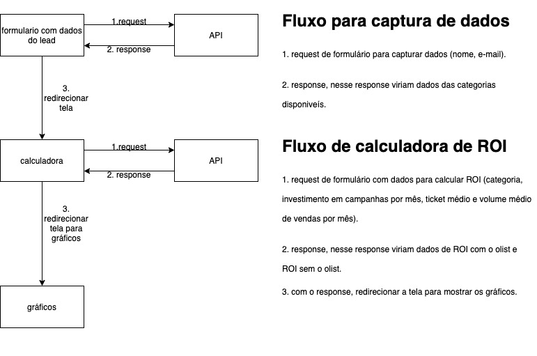

# Calculadora de ROI (wordpress)
Projeto para especificar frontend de uma aplicação que calcula ROI de leads e compara o valor com os serviços do **olist**. Esse projeto é separado em duas frentes: frontend e plugin. O frontend leva em conta o que será mostrado no site, e o plugin fica a parte do administrador do wordpress.

* A parte de frontend foi inspirada inicialmente nesta [página](https://olist.com/solucoes/como-comecar-a-vender/)

### Tecnologias usadas
* A calculadora fica visível no site principal do olist (olist.com), levando em conta a especificação de arquitetura, o plugin é desenvolvido em PHP. A parte de frontend é em HTML, CSS e JavaScript, ficando a par do wordpress renderizar o código.

### Arquitetura do plugin
* A parte de plugin para wordpress, pode seguir até mesmo a estrutura do [Contact Form](https://wordpress.org/plugins/contact-form-7/). O plugin cria uma tela nova na parte de admin, e contém um formulário que pergunta ao usuário em qual tela devem ser implementadas as telas do lead, após isso, mostra uma prévia e uma opção para salvar a alteração.

### Telas do frontend

* Para ver prints das telas e fluxo de trabalho entre elas no figma:
[telas](https://www.figma.com/proto/yMvQvtLgKBqELgwjMttYGH/calculadora-roi-frontend?node-id=33%3A2&scaling=min-zoom)

### Campos e funcionalidades
1. Tela inicial:

Campo | Tipo
--- | ---
Nome do responsável | string
E-mail da empresa | string, email

2. Tela com calculadora

Campo | Tipo
--- | ---
Categoria dos produtos | string
Investimentos em campanha por mês | decimal
Ticket médio | decimal
Volume médio de vendas por mês | decimal

3. Tela com resultado
* Gráfico com ROI sem o olist
* Gráfico com ROI com o olist

### Fluxo de comunicação do plugin com API
1. Fluxo de comunicação do plugin com API e redirecionamento de telas

