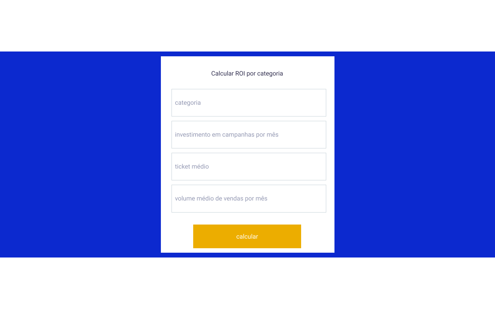

# calculadora-roi-frontend
Projeto para calcular ROI de leads e comparar o valor com os serviços do olist.

### Especificação de campos/funcionalidades
1. Tela inicial:
* Categoria dos produtos
* Investimentos em campanha por mês
* Ticket médio
* Volume médio de vendas por mês

2. Tela com resultado
* Gráfico com ROI sem o olist
* Gráfico com ROI com o olist

### Especificação de arquitetura
* Projeto frontend

### Especificação de tecnologias
* Projeto desenvolvido em React.js utilizando NextJs para melhor perfomance de SEO.

### Telas
1. Tela inicial

2. Tela com resultado da calculadora
